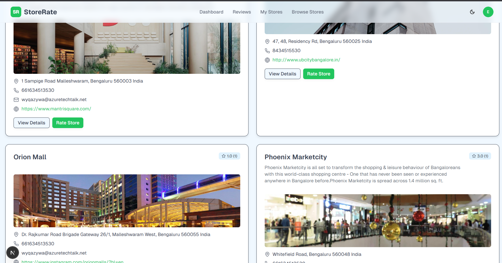

# StoreRate - Store Rating Platform

[](https://youtu.be/mb5oWhB5OH4)

> A comprehensive web application that allows users to submit ratings for stores with role-based access control and modern UI animations.

## 🚀 Tech Stack

- **Frontend**: Next.js 14, React 18, TypeScript
- **Styling**: Tailwind CSS, shadcn/ui components
- **Animations**: Framer Motion
- **Backend**: Next.js API Routes
- **Database**: PostgreSQL (Neon.tech)
- **ORM**: Prisma
- **Authentication**: JWT-based system

## 👥 User Roles & Features

### System Administrator
- **Dashboard**: View total users, stores, and ratings
- **User Management**: Add/manage normal users and admins
- **Store Management**: Add stores and view detailed listings
- **Filtering**: Filter users and stores by name, email, address, role
- **Full Access**: View all user details and ratings

### Normal User
- **Registration**: Self-signup with validation
- **Store Browsing**: View all registered stores with ratings
- **Search**: Find stores by name and address
- **Rating System**: Submit and modify ratings (1-5 scale)
- **Profile**: Update password and personal information

### Store Owner
- **Dashboard**: View store performance and average ratings
- **Customer Insights**: See users who rated their store
- **Profile Management**: Update password and store details

## 🛠 Installation & Setup

### Prerequisites
- Node.js 18+ and npm
- PostgreSQL database (Neon.tech account)

### Setup Steps

1. **Clone the repository**
```bash
git clone <repository-url>
cd storerate
```

2. **Install dependencies**
```bash
npm install
```

3. **Environment Configuration**
```bash
cp .env.example .env.local
```

Add these variables to your `.env.local`:
```env
DATABASE_URL="your-neon-database-connection-string"
JWT_SECRET="your-secure-jwt-secret-key"
NEXTAUTH_SECRET="your-nextauth-secret"
```


## 🔑 Admin Access

To access the admin side, use:

- **Username:** `admin123@gmail.com`
- **Password:** `admin123`


4. **Database Setup**
```bash
# Generate Prisma client
npx prisma generate

# Push schema to database
npx prisma db push


```

5. **Run the application**
```bash
# Development mode
npm run dev

# Production build
npm run build && npm start
```

The app will be available at `http://localhost:3000`

## 📋 Form Validations

| Field | Rules |
|-------|-------|
| **Name** | 20-60 characters |
| **Email** | Valid email format |
| **Password** | 8-16 characters, 1 uppercase, 1 special character |
| **Address** | Maximum 400 characters |

## 🎨 Features

### Core Functionality
- **Rating System**: 1-5 star ratings with real-time calculations
- **Search & Filter**: Advanced filtering for stores and users
- **Role-based Access**: Different interfaces for each user type
- **Responsive Design**: Mobile-first approach with Tailwind CSS

### UI/UX Enhancements
- **Smooth Animations**: Framer Motion powered interactions
- **Dark/Light Theme**: Toggle-able theme support
- **Modern Components**: shadcn/ui component library
- **Loading States**: Skeleton loaders and progress indicators

### Security
- **JWT Authentication**: Secure token-based auth system
- **Password Encryption**: Bcrypt hashing
- **Input Validation**: Server-side and client-side validation
- **Role Protection**: Route and API protection


### Environment Variables
Ensure these are set in production:
- `DATABASE_URL`
- `JWT_SECRET`
- `NEXTAUTH_SECRET`

## 📊 Database Schema

```sql
-- Key tables
Users (id, name, email, password, role, address)
Stores (id, name, email, address, average_rating)
Ratings (id, user_id, store_id, rating, created_at)
```

## 🤝 Contributing

1. Fork the repository
2. Create feature branch: `git checkout -b feature-name`
3. Commit changes: `git commit -m 'Add feature'`
4. Push to branch: `git push origin feature-name`
5. Submit Pull Request

## 📄 License

MIT License - see LICENSE file for details.

---

**Built with ❤️ using Next.js, Prisma, and Framer Motion**