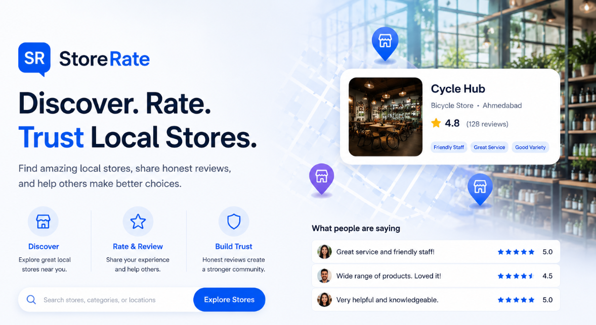

<div align="center">

  #  StoreRate

  **A platform to discover local stores, read customer reviews, and share your own ratings and feedback.**

  

  [](https://nextjs.org/)
  [](https://www.typescriptlang.org/)
  [](https://tailwindcss.com/)
  [](https://www.prisma.io/)
</div>


## ✨ Key Features

- Role-based access for Customers, Store Owners, and Admins  
- Browse stores with ratings and review snippets  
- Submit reviews with real-time rating updates  
- Admin control for users, stores, and analytics  
- Clean, modern UI built with Tailwind CSS  
- Secure JWT authentication using HttpOnly cookies  
## 🛠️ Technology Stack

- **Framework**: [Next.js 14](https://nextjs.org/) (App Router)
- **Language**: [TypeScript](https://www.typescriptlang.org/)
- **Styling**: [Tailwind CSS](https://tailwindcss.com/) & [shadcn/ui](https://ui.shadcn.com/)
- **Database**: [PostgreSQL](https://www.postgresql.org/) hosted on [Neon](https://neon.tech/)
- **ORM**: [Prisma](https://www.prisma.io/)
- **Icons**: [Lucide React](https://lucide.dev/)


## 🚀 Getting Started

Follow these instructions to get a local copy of the project up and running.

### Prerequisites

- Node.js (v18 or higher)
- npm or yarn or pnpm
- A PostgreSQL database connection string (e.g., from Neon.tech, Supabase, or local)

### Installation

1. **Clone the repository**
   ```bash
   git clone <repository-url>
   cd storerate
   ```

2. **Install dependencies**
   ```bash
   npm install
   ```

3. **Configure Environment Variables**
   Create a `.env` file in the root directory and add the following keys:
   ```env
   DATABASE_URL="your-postgresql-connection-string"
   JWT_SECRET="your-secure-random-jwt-secret"
   ```

4. **Initialize the Database**
   Push the Prisma schema to your database to create the necessary tables:
   ```bash
   npx prisma generate
   npx prisma db push
   ```

5. **Start the Development Server**
   ```bash
   npm run dev
   ```
   The application will be available at [http://localhost:3000](http://localhost:3000).


## 🧪 Testing the Platform

To explore the full capabilities of the platform, an admin account has been pre-configured (or can be seeded). Use the following credentials to log in and test the administrative features:

### Admin Credentials
- **Email:** `admin123@gmail.com`
- **Password:** `admin123`

*Logging in as an admin provides access to the `/admin` where you can create test stores, assign store owners, and manage all user accounts.*


## 🤝 Contributing

Contributions are what make the open source community such an amazing place to learn, inspire, and create. Any contributions you make are **greatly appreciated**.

1. Fork the Project
2. Create your Feature Branch (`git checkout -b feature/AmazingFeature`)
3. Commit your Changes (`git commit -m 'Add some AmazingFeature'`)
4. Push to the Branch (`git push origin feature/AmazingFeature`)
5. Open a Pull Request

## 📄 License

Distributed under the MIT License. See `LICENSE` for more information.